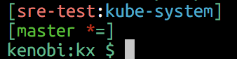
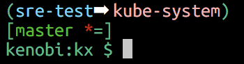

# kx

A more convenient method for changing contexts and name spaces for kubectl

## Usage:

    kx [context [namespace]] [-a|--all] [-s|--set] [--no-color]

To add to prompt:

    $ export PROMPT_COMMAND=$(kx prompt)

## Examples:

Change context and namespace

    $ kx new-context new-namespace

Use a dash as the context name to stay in the same context but change namespace

    $ kx - new-namespace

Change context, keep the namespace set in .kube/config

    $ kx new-context

Change back to the previous context and namespace

    $ kx
    first-ctx first-ns
    $ kx second-ctx second-ns
    $ kx
    second-ctx second-ns
    $ kx -
    $ kx
    first-ctx first-ns
    $ kx -
    $ kx
    second-ctx second-ns

Generate tab completion for the contexts in your kubeconfig

    $ eval "$(kx complete)"
    $ kx <tab><tab>
    foo-prd        gke_prd-usc1-1     foo-test
    foo-gke-prd    int-usw1a          stg-use1a
    foo-gke-stg    minikube           stg-use1b

Rename a context

    $ kx -r new-name old-name

Show current context and namespace

    $ kx
    current-context current-namespace

Set a favorite context/namespace pair


    [some-ctx:some-ns]
    $ kx fave-ctx fave-ns -f my-fave
    ...
    [some-ctx:some-ns]
    $ kx my-fave
    [fave-ctx:fave-ns]
    $ 


Show all contexts and namespaces. Favorites for each ns are listed as well

```
$ kx -a
Current Context     Namespace       Favorites
        foo-prd     bar             prod=foo-prd:bar
-->     foo-test    kube-system     pkube=foo-test:kube-system,test=foo-test:bar

```

## Configuration

`kx` is a [cobra app](https://github.com/spf13/cobra) so it is configured the same way as any other similar app.

The default location for this file is `$HOME/.kx.yaml`. The prompt generated by `kx prompt` can by configured here. Favorites are also stored here.

### Configuring the Prompt

The prompt is completely configurable. The parts of which are defined like so:

    prompt:
      separator: string
      leftWrapper: string
      rightWrapper: string
      contextColor: color* 
      namespaceColor: color*
      separatorColor: color*
      colorOff: \033[0m  # special required value, will be depracated 

_* see [color configuration](#colors)_

To display a prompt that appears like this:

    [the-context:the-namespace]
   
The following configuration can be used:

    prompt:
      separator: ':'
      leftWrapper: '['
      rightWrapper: ']'
      contextColor: Red
      namespaceColor: K8sBlue
      separatorColor: White

How it looks with color:



To display a prompt that appears like this:

    (the-context➡ the-namespace)
   
The following configuration can be used:

    prompt:
      separator: '➡ '
      leftWrapper: '('
      rightWrapper: ')'
      contextColor: MayaBlue
      namespaceColor: LightPink1
      separatorColor: White
      
How it looks with color:



### Colors<a name="colors"></a>

Colors are configured using the name of the color. These names can be found in [`pkg/colors/colors.go`](pkg/colors/colors.go). This will be replaced in the future with a command to list them.

_Note: color names may change slightly in the future to be consistent with Go capitalization._
      
### Favorites

Favorites are also stored in in `.kx.yaml`. Should be pretty obvious how these work:

    favorites:
      pkube:
        context: foo-test
        namespace: kube-system
      prod:
        context: foo-prd
        namespace: bar
      test:
        context: foo-test
        namespace: bar

## Todo

- [X] Work with custom locations of kubeconfig via the `KUBECONFIG` env var.
- [X] Support for favorite ctx/namespace pairs.
- [X] Add context names to bash completion.
- [X] Ability to rename contexts.
- [X] Return to previous context/namespace
- [X] Work with locations of kubeconfig passed via the command line.
- [ ] Command to show color options.
- [ ] Code clean up.
- [ ] Better error messaging.


## Thanks

Thanks to the following folks for helping out, you guys rock!

 - [Micah Elliot](https://gist.github.com/MicahElliott): Author of the [colortrans.py script](https://gist.github.com/naupaka/a300868203f32906717a1644c1c6f0d7) to convert between RGB and xterm-256 color codes
